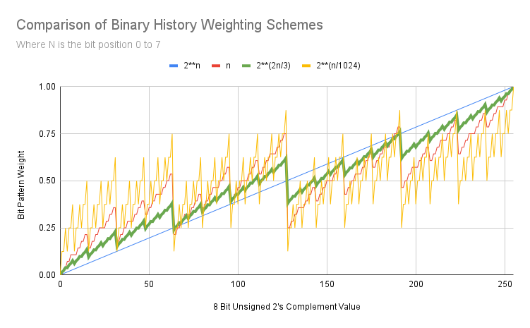

# Binary History Probability Table

The Binary History Probability Table, BHPT, is a class used to randomly select an index for an entry in the table based on the entry's probability.
The probability for each entry is a function of the recorded binary history.

The class provides these methods:

| Method            | Description                                      
|:------------------|:-----------------------------------------------------|
| \_\_getitem\_\_() | Return the maintained history of the indexed entry   |
| \_\_setitem\_\_() | Push in the most recent state for the entry          |
| get()             | Return an index randomly based on weight (see below) |
| insert()          | Create a new entry with initial state                | 
| remove()          | Remove and entry from the table                      |
| set_mwsp()        | Set the Minimal Weight State Position                |
| set_defer()       | Choose to defer weight calculations                  |

## Concept Overview

A BHPT table has the following structure:

| **Index** | **History** | **Weight** |
|:---------:|:-----------:|:----------:|
| 0         | 10001011101 |    26.675  |
| 1         | 00110110001 |    22.082  |
| 2         | 00000110001 |     9.176  |
| ...       | ...         |    ...     |
| I-1       | 11111101101 |    42.420  |

Where history is the history of the binary variable represented by the row (entry) and **Weight = f(History)**.
The probability of any row being selected is directly proportional to the **Weight**.

## The Weight & Probability Functions

Consider the history of a binary variable to be represented as below.

| **Position** | 15 | 14 | 13 | 12 | 11 | 10 | 9 | 8 | 7 | 6 | 5  | 4  | 3  | 2  | 1  | 0  |
|-------------:|:--:|:--:|:--:|:--:|:--:|:--:|:-:|:-:|:-:|:-:|:--:|:--:|:--:|:--:|:--:|:--:| 
| **Age**      | 0  | 1  | 2  | 3  | 4  | 5  | 6 | 7 | 8 | 9 | 10 | 11 | 12 | 13 | 14 | 15 |
| **State**    | T  | T  | F  | F  | F  | T  | F | T | F | F | F  | T  | T  | F  | T  | T  |

Where age 0 is the most recent state of the variable, age 1 is the previous state, age 2 the state
before that and so on until age 15, in this example, which was the state 15 transitions prior. Note
that the position in the history is the inverse of the age i.e. history length, __L__, minus the age.
__T__ = True and __F__ = False which are synonomous with 1 and 0.

The weight function takes a variables history and estimates a value proportional to the probability
of the next state being True.

The default behaviour is for entry at index __e__ to have weight __w<sub>e</sub>__ and probability of
selection __p<sub>e</sub>__ considering the __N__ most recent state values:

> w<sub>e</sub> = sum(2<sup>3n/2</sup>s<sub>n</sub>) for n = 0 to N-1

> p<sub>e</sub> = w<sub>e</sub>/sum(w<sub>i</sub>) for i = 0  to I-1

Where __n__ is the position, __s__ is the state value (1 or 0) and __I__ is the number of entries in the
table. The chart below shows the default scheme in green compared to some other possible solutions.


There are many more sophisticated methods of probability prediction that may be implemented as long as the
requirement that a consideration history (N) of all 0's (all False) has a probability of 0.0.

## Entry Insertion

Insertion of an entry into the table when __auto_remove == False__ requires that an index be free otherwise
a ValueError is raised. __insert()__ returns the index to be used to set state for that entry and identify it
if it is selected by __get()__. When __auto_remove == True__ an empty index will be used if there is one
otherwise the entry with the lowest weight will be removed
and that index will be returned. In the event that multiple entries have the same lowest weight an entry from
that set will be chosen at random to be removed.

## Entry Removal

Removal of an entry is done by clearing its valid status and wiping its history. Setting state on an invalid
index make it valid.

## Minimal Weight State Position

If a 0.0 probability is not desirable even for entries that would have all 0 consideration histories the minimal
weight state position may be set, __mwsp = True__. When the weight of an entry is calculated the state in the last
consideration position is treated as True regardless of its actual value resulting
in random selection if all histories are 0. __mwsp__ may be set or cleared at any time.

## Precision

Using the default weight and probability functions if log2(I) + log2(2N/3) > 56 the smallest weights (oldest states
in the consideration history) may have no influence due to the maximum precision that can be held in a 64 bit
float. The results will still be accurate to 64 bit float precision but there will be needless calculation and
storage (if N == L).

## Defering Weight Calculations

By default __defer__ is set to False and every time a new state is pushed into an entries history the
weight for that entry is calculated. This is efficient if __get()__ is usually called after a single
state update. However if __get()__ is called relatively rarely then it is more effcient to update
the weights for all entries in bulk. In that case set __defer == True__. __defer__ can be changed
at anytime.

Note that probabilities are only ever calculated from weights if at least one history has changed. Thus calling
__get()__ without doing any __\_\_setitem\_\___() inbetween will not unecessarily calculate the probabilities.

# Memory Usage

Memory allocated is static from instanciation and is approximately I(L + 17) + 8L + 128 bytes e.g. a 2<sup>16</sup> entry
buffer with a history length of 64 bit would consume approximately 2<sup>16</sup>(64 + 17) + 8 * 64 + 128 = 5309056 bytes
which is ~5 MBytes.

# Usage

To create a table with the capacity for 1024 entries each with a history capacity of 80 bits
```python
my_table = bhpt(1024, 80)
``` 

# Uncommitted Roadmap

1. Use a simple neural network for the weight function that learns from the history.

