# GC Insertion
Insertion of a GC into another GC falls into one of 3 categories:

- Wrapping: Not technically insertion. Stacking one GC on top of the other and wrapping it in a new resultant GC.
- Reorganising: The target GC has an unoccupied GCA or GCB so only a new resultant GC is needed.
- Restructuring: A Resultant GC and a Fetal GC will be required.

## Definitions

| Term | Definition |
|------|------------|
| RGC  | Resultant GC. The GC product of the insertion operation |
| TGC  | Target GC. The GC to be inserted into. |
| IGC  | Inerstion GC. The GC inserted into TGC to make RGC. |
| FGC  | The fetal GC. A secondary GC created as part of the insertion. |
| xGC[y] | A specific row where x is one of RTIF and y is a row letter. |
| xGC[yc] | Used in an I or O row deinition. x & y defined as above. 'c' identifies that only connected endpoints of the original row are part of the interface. See section below.
| xGC[y] + wGC[z] | Used in an I or O row deinition. x & y defined as above. w & z defined the same as x & y. Interface row is the concatenation, in order, of the specified rows.
| `#001000` | Background color for the RGC.
| `#604000` | Background color for a row created from an existing interface.
| `#300000` | Background color for new row definition.
| `#000000` | Background color for unchanged row or interface.

In any insertion event TGC and IGC are not modified RGC and any FGC are new GC's with copies of TGC & IGC data as specified in the following sections.

### xGC[yc] Interface Definition

The xGC[yc] interface is critical to stabilization of of GC graphs. Consider an unstable graph where there an unconnected GCA destination end points because row I and C do not have matching types. To fix this situation a GC must be inserted above row A that has the missing source end point types (Case 4 defined below). To give the maximum likihood of stability and the minimum distruption for the resultant RGC and FGC the following needs to happen:

- The low index FGC outputs (row O) must be the same as TGC[GCA]
- The the connections in TGC to GCA destinations must persist to GCA in FGC
- Any TGC[I] or TGC[C] end points that match IGC destination must be passed in to FGC

In this way existing connections from the original TGC are guaranteed and IGC has the maximum opportunity to resolve the original instability without creating a new instability (with somewhat careful selection of IGC the risks collapse a great deal if not entirely).

NB: IGC[O] is appended to TGC[GCA] source endpoints to make FGC[O] to maximise the exposure of IGC outputs.

## Wrapping
There are 2 wrapping cases: Stack (case 1) and Inverse stack (case 11). These cases are symmetrical stacking TGC:IGC or IGC:TGC.

### Case 0: Stack
|               |   |
|---------------|---|
| Rows present in TGC | I |
| Rows not present | None |
| Insert IGC above | Z | 

TGC on top.

```mermaid
%% Insertion Case 1: Stack
flowchart TB
    I["TGC[I]"]
    subgraph RGC
        direction RL
        GCA["A: TGC"]
        GCB["B: IGC"]
    end
    O["IGC[O]"]
    I --> RGC --> O

classDef newGC fill:#010,stroke:#333,stroke-width:4px
classDef newRow fill:#010,stroke:#333,stroke-width:1px
classDef modified fill:#640,stroke:#333,stroke-width:1px
classDef unchanged fill:#000,stroke:#333,stroke-width:1px

class RGC newGC
class GCA modified
class GCB modified
```

### Case 11: Inverse Stack
|               |   |
|---------------|---|
| Rows present | O |
| Rows not present | None |
| Insert IGC above | I | 
IGC on top.
```mermaid
%% Insertion Case 11: Inverse Stack
flowchart TB
    I["IGC[I]"]
    subgraph RGC
        direction RL
        GCA["A: IGC"]
        GCB["B: TGC"]
    end
    O["TGC[O]"]
    I --> RGC --> O

classDef newGC fill:#010,stroke:#333,stroke-width:4px
classDef newRow fill:#010,stroke:#333,stroke-width:1px
classDef modified fill:#640,stroke:#333,stroke-width:1px
classDef unchanged fill:#000,stroke:#333,stroke-width:1px

class RGC newGC
class GCA modified
class GCB modified
```

## Reorganising
In these cases TGC has no GCB which means IGC can be inserted without requiring an FGC. Note that when the TGC is a codon there is an implicit GCA. An alternate way of thinking about it is that TGC is a virtual GC a wrapper with the same interfaces directly connected to the codon as GCA.

When reorganising it matters if there is a row F as it affects the control flow.

### Case 1
|               |   |
|---------------|---|
| Rows present | N/A |
| Rows not present | A, B, F |
| Insert IGC above | A | 

```mermaid
%% Insertion Case 1
flowchart TB
    I["TGC[I]"]
    C["TGC[C]"]
    subgraph RGC
        direction RL
        IGC["A: IGC"]
    end
    O["TGC[O]"]
    I --> RGC --> O
    C --> RGC
classDef newGC fill:#010,stroke:#333,stroke-width:4px
classDef newRow fill:#010,stroke:#333,stroke-width:1px
classDef modified fill:#640,stroke:#333,stroke-width:1px
classDef unchanged fill:#000,stroke:#333,stroke-width:1px

class RGC newGC
class TGC modified
class IGC modified
```

### Case 2
|               |   |
|---------------|---|
| Rows present | A |
| Rows not present | B, F |
| Insert IGC above | A | 

```mermaid
%% Insertion Case 2
flowchart TB
    I["TGC[I]"]
    C["TGC[C]"]
    subgraph RGC
        direction RL
        IGC["A: IGC"]
        TGC["B: TGC[A]"]
    end
    O["TGC[O]"]
    I --> RGC --> O
    C --> RGC
classDef newGC fill:#010,stroke:#333,stroke-width:4px
classDef newRow fill:#010,stroke:#333,stroke-width:1px
classDef modified fill:#640,stroke:#333,stroke-width:1px
classDef unchanged fill:#000,stroke:#333,stroke-width:1px

class RGC newGC
class TGC modified
class IGC modified
```

### Case 3
|               |   |
|---------------|---|
| Rows present | A |
| Rows not present | B, F |
| Insert IGC above | B, O | 

```mermaid
%% Insertion Case 3
flowchart TB
    I["TGC[I]"]
    C["TGC[C]"]
    subgraph RGC
        direction RL
        IGC["A: TGC[A]"]
        TGC["B: IGC"]
    end
    O["TGC[O]"]
    I --> RGC --> O
    C --> RGC

classDef newGC fill:#010,stroke:#333,stroke-width:4px
classDef newRow fill:#010,stroke:#333,stroke-width:1px
classDef modified fill:#640,stroke:#333,stroke-width:1px
classDef unchanged fill:#000,stroke:#333,stroke-width:1px

class RGC newGC
class TGC modified
class IGC modified
```

## Restructuring

### Case 4
|               |   |
|---------------|---|
| Rows present | A, B |
| Rows not present |F |
| Insert IGC above | A | 

```mermaid
%% Insertion Case 4
flowchart TB
    I1["TGC[I]"]
    C["TGC[C]"]
    subgraph RGC
        direction RL
        GCA1["A: FGC"]
        GCB1["B: TGC[B]"]
    end
    O1["TGC[O]"]
    I1 --> RGC --> O1
    C --> RGC

    I2["TGC[Ac]"]
    subgraph FGC
        direction RL
        GCA2["A: IGC"]
        GCB2["B: TGC[A]"]
    end
    O2["TGC[A] + IGC[O]"]
    I2 --> FGC --> O2

classDef newGC fill:#010,stroke:#333,stroke-width:4px
classDef newRow fill:#300,stroke:#333,stroke-width:1px
classDef modified fill:#640,stroke:#333,stroke-width:1px
classDef unchanged fill:#000,stroke:#333,stroke-width:1px

class RGC newGC
class GCB1 unchanged
class GCA1 newRow
class FGC newGC
class GCA2 modified
class GCB2 modified
class I1 unchanged
class I2 newRow
class O1 unchanged
class O2 newRow
class C unchanged
```

### Case 5
|               |   |
|---------------|---|
| Rows present | A, B |
| Rows not present | F |
| Insert IGC above | B | 

```mermaid
%% Insertion Case 5
flowchart TB
    I1["TGC[I]"]
    C["TGC[C]"]
    subgraph RGC
        direction RL
        GCA1["A: FGC"]
        GCB1["B: TGC[B]"]
    end
    O1["TGC[O]"]
    I1 --> RGC --> O1
    C --> RGC

    I2["TGC[Ac]"]
    subgraph FGC
        direction RL
        GCA2["A: TGC[A]"]
        GCB2["B: IGC"]
    end
    O2["TGC[A] + IGC[O]"]
    I2 --> FGC --> O2

classDef newGC fill:#010,stroke:#333,stroke-width:4px
classDef newRow fill:#300,stroke:#333,stroke-width:1px
classDef modified fill:#640,stroke:#333,stroke-width:1px
classDef unchanged fill:#000,stroke:#333,stroke-width:1px

class RGC newGC
class GCB1 unchanged
class GCA1 newRow
class FGC newGC
class GCA2 modified
class GCB2 modified
class I1 unchanged
class I2 newRow
class O1 unchanged
class O2 newRow
class C unchanged
```

### Case 6
|               |   |
|---------------|---|
| Rows present | A, B |
| Rows not present | F |
| Insert IGC above | O | 

```mermaid
%% Insertion Case 6
flowchart TB
    I1["TGC[I]"]
    C["TGC[C]"]
    subgraph RGC
        direction RL
        GCA1["A: TGC[A]"]
        GCB1["B: FGC"]
    end
    O1["TGC[O]"]
    I1 --> RGC --> O1
    C --> RGC

    I2["TGC[Bc]"]
    subgraph FGC
        direction RL
        GCA2["A: TGC[B]"]
        GCB2["B: IGC"]
    end
    O2["TGC[B] + IGC[O]"]
    I2 --> FGC --> O2

classDef newGC fill:#010,stroke:#333,stroke-width:4px
classDef newRow fill:#300,stroke:#333,stroke-width:1px
classDef modified fill:#640,stroke:#333,stroke-width:1px
classDef unchanged fill:#000,stroke:#333,stroke-width:1px

class RGC newGC
class GCA1 unchanged
class GCB1 newRow
class FGC newGC
class GCA2 modified
class GCB2 modified
class I1 unchanged
class I2 newRow
class O1 unchanged
class O2 newRow
class C unchanged
```

### Case 7
|               |   |
|---------------|---|
| Rows present | A, F |
| Rows not present | N/A |
| Insert IGC above | A | 

```mermaid
%% Insertion Case 7
flowchart TB
    I1["TGC[I]"]
    C["TGC[C]"]
    subgraph RGC
        direction LR
        F1["F: TGC[F]"]
        GCA1["A: FGC"]
        GCB1["B: TGC[B]"]
        F1 -.-> GCA1
        F1 -.-> GCB1
    end
    O1["TGC[O]"]
    P1["TGC[P]"]
    I1 --> RGC
    C --> RGC
    GCA1 --> O1
    GCB1 --> P1

    I2["TGC[Ac]"]
    subgraph FGC
        direction RL
        GCA2["A: IGC"]
        GCB2["B: TGC[A]"]
    end
    O2["TGC[A] + IGC[O]"]
    I2 --> FGC --> O2

classDef newGC fill:#010,stroke:#333,stroke-width:4px
classDef newRow fill:#300,stroke:#333,stroke-width:1px
classDef modified fill:#640,stroke:#333,stroke-width:1px
classDef unchanged fill:#000,stroke:#333,stroke-width:1px

class RGC newGC
class GCB1 unchanged
class GCA1 newRow
class FGC newGC
class GCA2 modified
class GCB2 modified
class I1 unchanged
class I2 newRow
class O1 unchanged
class O2 newRow
class C unchanged
class F1 unchanged
class P1 unchanged
```

### Case 8
|               |   |
|---------------|---|
| Rows present | A, F |
| Rows not present | N/A |
| Insert IGC above | O | 

```mermaid
%% Insertion Case 8
flowchart TB
    I1["TGC[I]"]
    C["TGC[C]"]
    subgraph RGC
        direction LR
        F1["F: TGC[F]"]
        GCA1["A: FGC"]
        GCB1["B: TGC[B]"]
        F1 -.-> GCA1
        F1 -.-> GCB1
    end
    O1["TGC[O]"]
    P1["TGC[P]"]
    I1 --> RGC
    C --> RGC
    GCA1 --> O1
    GCB1 --> P1

    I2["TGC[Ac]"]
    subgraph FGC
        direction RL
        GCA2["A: TGC[A]"]
        GCB2["B: IGC"]
    end
    O2["TGC[A] + IGC[O]"]
    I2 --> FGC --> O2

classDef newGC fill:#010,stroke:#333,stroke-width:4px
classDef newRow fill:#300,stroke:#333,stroke-width:1px
classDef modified fill:#640,stroke:#333,stroke-width:1px
classDef unchanged fill:#000,stroke:#333,stroke-width:1px

class RGC newGC
class GCB1 unchanged
class GCA1 newRow
class FGC newGC
class GCA2 modified
class GCB2 modified
class I1 unchanged
class I2 newRow
class O1 unchanged
class O2 newRow
class C unchanged
class F1 unchanged
class P1 unchanged
```

### Case 9

|               |   |
|---------------|---|
| Rows present | A, F |
| Rows not present | N/A |
| Insert IGC above | P | 

```mermaid
%% Insertion Case 10
flowchart TB
    I1["TGC[I]"]
    C["TGC[C]"]
    subgraph RGC
        direction LR
        F1["F: TGC[F]"]
        GCA1["A: TGC[B]"]
        GCB1["B: FGC"]
        F1 -.-> GCA1
        F1 -.-> GCB1
    end
    O1["TGC[O]"]
    P1["TGC[P]"]
    I1 --> RGC
    C --> RGC
    GCA1 --> O1
    GCB1 --> P1

    I2["TGC[Bc]"]
    subgraph FGC
        direction RL
        GCA2["A: TGC[B]"]
        GCB2["B: IGC"]
    end
    O2["TGC[B] + IGC[O]"]
    I2 --> FGC --> O2

classDef newGC fill:#010,stroke:#333,stroke-width:4px
classDef newRow fill:#300,stroke:#333,stroke-width:1px
classDef modified fill:#640,stroke:#333,stroke-width:1px
classDef unchanged fill:#000,stroke:#333,stroke-width:1px

class RGC newGC
class GCB1 newRow
class GCA1 unchanged
class FGC newGC
class GCA2 modified
class GCB2 modified
class I1 unchanged
class I2 newRow
class O1 unchanged
class O2 newRow
class C unchanged
class F1 unchanged
class P1 unchanged
```

### Case 10
|               |   |
|---------------|---|
| Rows present | A, B, F |
| Rows not present | N/A |
| Insert IGC above | B | 

```mermaid
%% Insertion Case 9
flowchart TB
    I1["TGC[I]"]
    C["TGC[C]"]
    subgraph RGC
        direction LR
        F1["F: TGC[F]"]
        GCA1["A: TGC[B]"]
        GCB1["B: FGC"]
        F1 -.-> GCA1
        F1 -.-> GCB1
    end
    O1["TGC[O]"]
    P1["TGC[P]"]
    I1 --> RGC
    C --> RGC
    GCA1 --> O1
    GCB1 --> P1

    I2["TGC[Bc]"]
    subgraph FGC
        direction RL
        GCA2["A: IGC"]
        GCB2["B: TGC[B]"]
    end
    O2["TGC[B] + IGC[O]"]
    I2 --> FGC --> O2

classDef newGC fill:#010,stroke:#333,stroke-width:4px
classDef newRow fill:#300,stroke:#333,stroke-width:1px
classDef modified fill:#640,stroke:#333,stroke-width:1px
classDef unchanged fill:#000,stroke:#333,stroke-width:1px

class RGC newGC
class GCB1 newRow
class GCA1 unchanged
class FGC newGC
class GCA2 modified
class GCB2 modified
class I1 unchanged
class I2 newRow
class O1 unchanged
class O2 newRow
class C unchanged
class F1 unchanged
class P1 unchanged
```
